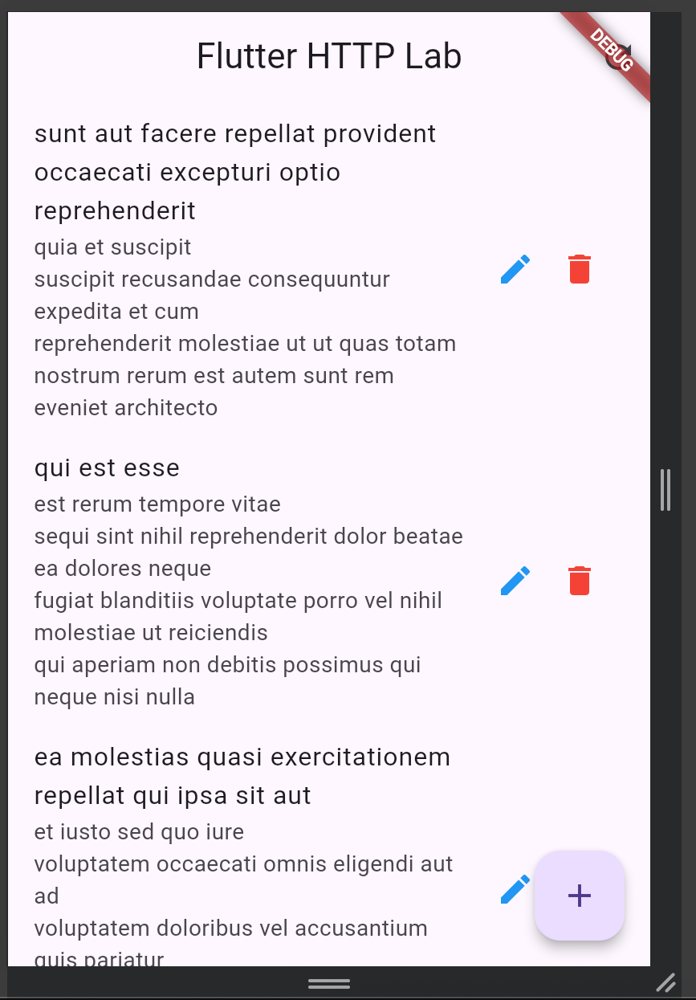
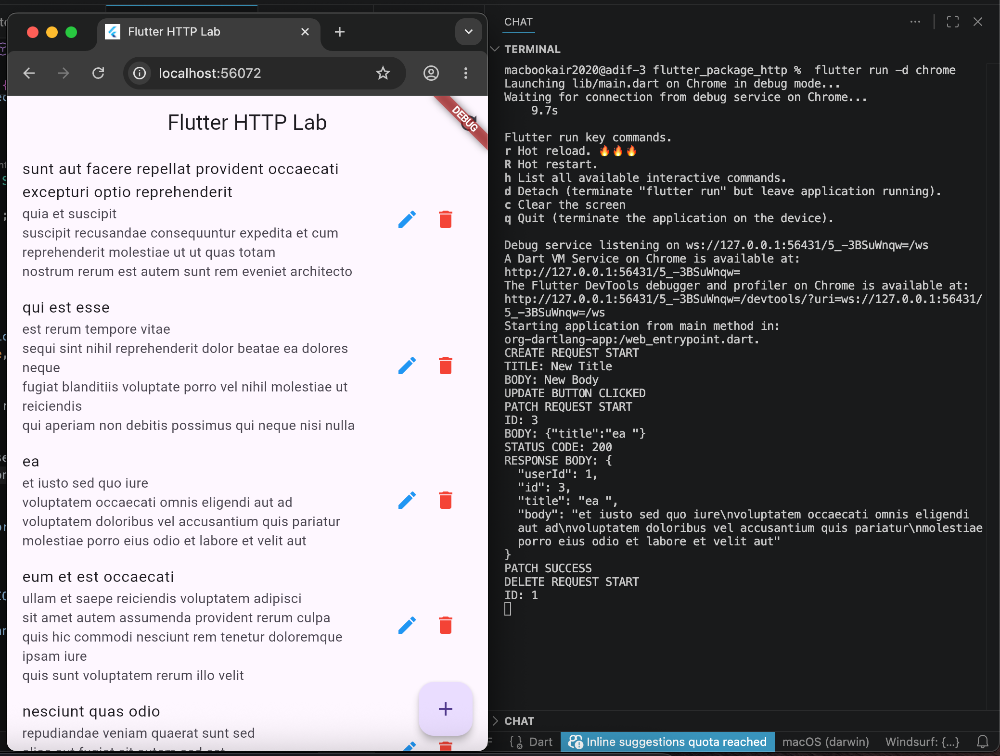
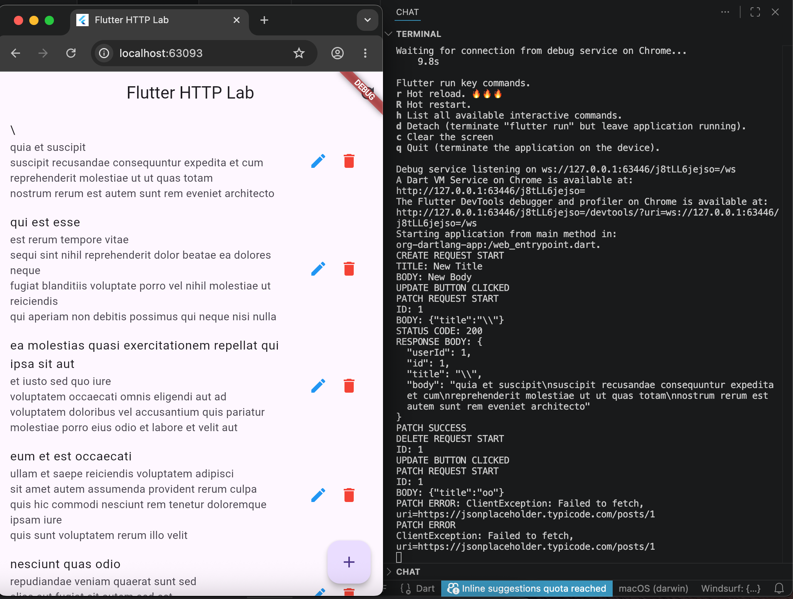

# API http method and Shared Prefrences 

# Documentation
on these project contain about :

        - API 
        - Shared Preferences

to run, enter the project folder [main script](flutter_package_http/lib/main.dart)

run command 

        flutter run

## Implementation Checklist & Evidence

| Status | Item | Required Evidence |
| :---: | :--- | :--- |
| [ ] | **GET** implemented | Screenshot of list screen |
| [ ] | **POST** implemented | SnackBar or log showing success |
| [ ] | **PATCH** implemented | Screenshot/log after update |
| [ ] | **DELETE** implemented | SnackBar or log showing success |
| [ ] | **Error handling** implemented | Screenshot of error/retry screen |

---

### Evidence Gallery

*To include your evidence, replace the placeholder text below with your actual image paths or log snippets.*

#### 1. GET Implementation
> [!TIP]
> 

#### 2. POST, Patch, And Delete Implementation
> [!TIP]
> 

#### 5. Error Handling
> [!TIP]
> 